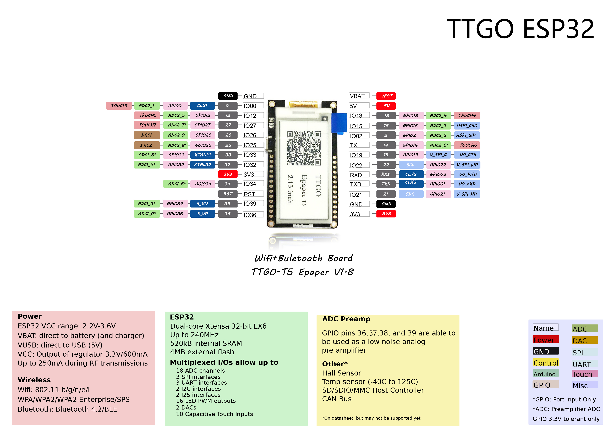

# TTGO - Yahoo Weather example

### Install the following library support
* [GxEPD](https://github.com/ZinggJM/GxEPD)
* [ArduinoJson 5.13.2](https://github.com/bblanchon/ArduinoJson)
* [Adafruit-GFX-Library](https://github.com/adafruit/Adafruit-GFX-Library)

### Yahoo Weather Reference
- [Yahoo Weather Code](https://developer.yahoo.com/weather/documentation.html?guccounter=1)
- [Yahoo Weather API](https://developer.yahoo.com/weather/?guccounter=1)

### Step:
- Changed in line yahoo.cpp Line 77 `YAHOO_URL_LOCATION(shenzhen)` Changed to the city you need to get
- Compile with Arduino IED, burn to board
- For the first time you need to use [SmartConfig Android](https://play.google.com/store/apps/details?id=com.cmmakerclub.iot.esptouch) or [Esptouch](https://www.espressif.com/en/products/software/esp-touch/resources)for wifi setup
